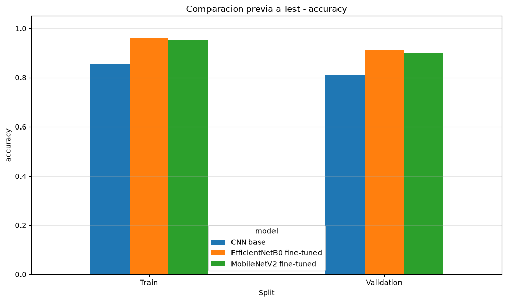
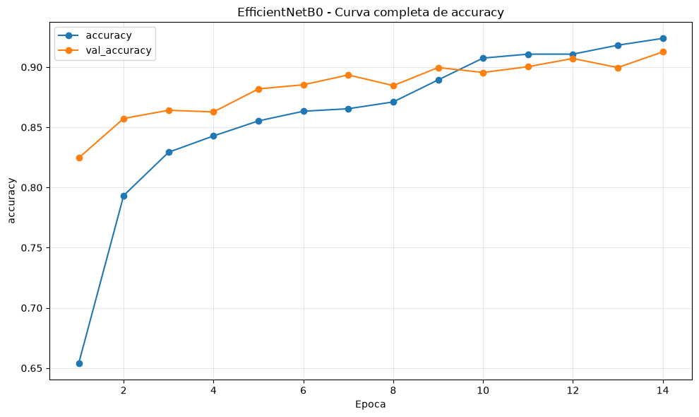
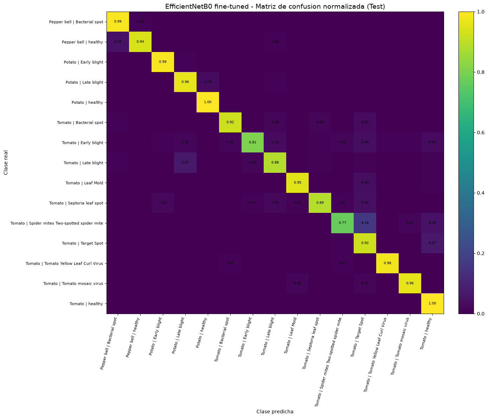
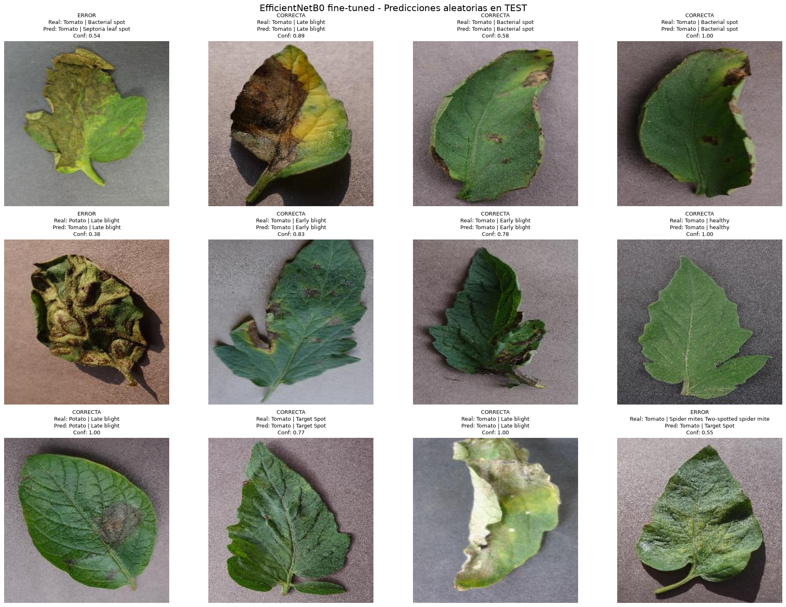

# Plant Disease Classification with Deep Learning

Deep Learning and Computer Vision pipeline for multiclass plant disease classification using the PlantVillage dataset.

The project compares a custom Convolutional Neural Network with Transfer Learning architectures based on MobileNetV2 and EfficientNetB0, including data augmentation, class imbalance handling, fine-tuning, model evaluation and Grad-CAM interpretability.

## Project Overview

Plant diseases can significantly affect crop health and agricultural productivity. This project explores the use of Deep Learning for image-based classification of foliar diseases across tomato, potato and pepper plants.

The complete dataset indexing process identified 22,787 images across 15 classes. The currently documented experiment was executed in validation mode using 9,634 images.

To reduce the risk of data leakage, Train, Validation and Test partitions were created using `leaf_id` grouping whenever available, preventing images associated with the same identified leaf from appearing across different subsets.

## Models

Three architectures were evaluated:

- Custom CNN
- MobileNetV2 with Transfer Learning and fine-tuning
- EfficientNetB0 with Transfer Learning and fine-tuning

EfficientNetB0 was selected using Macro-F1 performance on the Validation set before final evaluation on Test.

## Results

| Model | Test Accuracy | Macro F1 |
|---|---:|---:|
| Custom CNN | 82.34% | 81.90% |
| MobileNetV2 | 90.86% | 90.96% |
| EfficientNetB0 | **92.66%** | **92.89%** |

Final EfficientNetB0 performance:

- Test Accuracy: **92.66%**
- Macro Precision: **93.15%**
- Macro Recall: **93.15%**
- Macro F1-score: **92.89%**
- Macro ROC-AUC OvR: **0.9982**

EfficientNetB0 improved Macro-F1 by approximately 11 percentage points compared with the custom CNN baseline while reducing training time by approximately 73%.

## Model Selection

The models were compared before final Test evaluation using Train and Validation performance.



EfficientNetB0 achieved the strongest Validation performance and was selected as the final model for Test evaluation.

---

## Training Performance

Training and validation accuracy remained relatively close throughout training, showing stable learning behavior and limited overfitting.



---

## Test Confusion Matrix

The normalized confusion matrix shows strong performance across most of the 15 classes, while also highlighting more challenging categories such as Tomato Early Blight, Septoria Leaf Spot and Spider Mites.



---

## Sample Predictions on Test Set

The following examples show both correct and incorrect predictions produced by the final EfficientNetB0 model on the Test set.



These examples provide a qualitative view of model behavior and confidence beyond aggregate evaluation metrics.

## Methodology

The workflow includes:

1. Dataset indexing and metadata extraction
2. Leaf-based Train/Validation/Test partitioning
3. Image preprocessing
4. Data augmentation
5. Class weighting
6. TensorFlow `tf.data` pipeline optimization
7. Custom CNN training
8. Transfer Learning with MobileNetV2
9. Transfer Learning with EfficientNetB0
10. Fine-tuning
11. Validation-based model selection
12. Test evaluation
13. Class-level error analysis
14. Confidence-based misclassification analysis
15. Grad-CAM interpretability

## Dataset

The project uses images from the PlantVillage dataset.

The complete indexed dataset contains:

- **22,787 images**
- **15 classes**
- Tomato, potato and pepper categories
- Healthy and diseased leaves

The documented validation experiment uses:

- **9,634 images**
- **6,725 Train**
- **1,465 Validation**
- **1,444 Test**

The dataset itself is not stored in this repository.

## Technologies

- Python
- TensorFlow
- Keras
- Scikit-learn
- Pandas
- NumPy
- Matplotlib
- EfficientNetB0
- MobileNetV2
- Transfer Learning
- Fine-tuning
- Grad-CAM

## Explainability

Grad-CAM was used to visualize the image regions influencing EfficientNetB0 predictions.

This allows inspection of whether the model focuses on visually relevant regions of the leaf when making classification decisions.

## Limitations

The reported metrics correspond to the validation-mode experiment using 9,634 images rather than the complete 22,787-image indexed dataset.

Additionally, `leaf_id` grouping is based on official mapping when available and fallback identifiers for images without a mapped leaf identifier.

The results should therefore be interpreted within the experimental configuration described in this repository.

## Repository Structure

```text
plant-disease-deep-learning/
├── notebooks/
├── results/
├── docs/
├── requirements.txt
├── README.md
└── .gitignore
